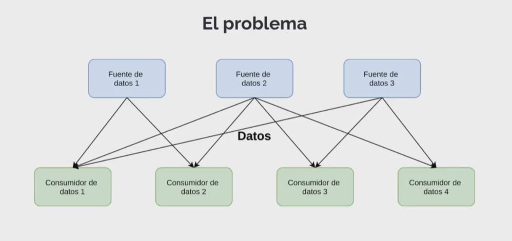
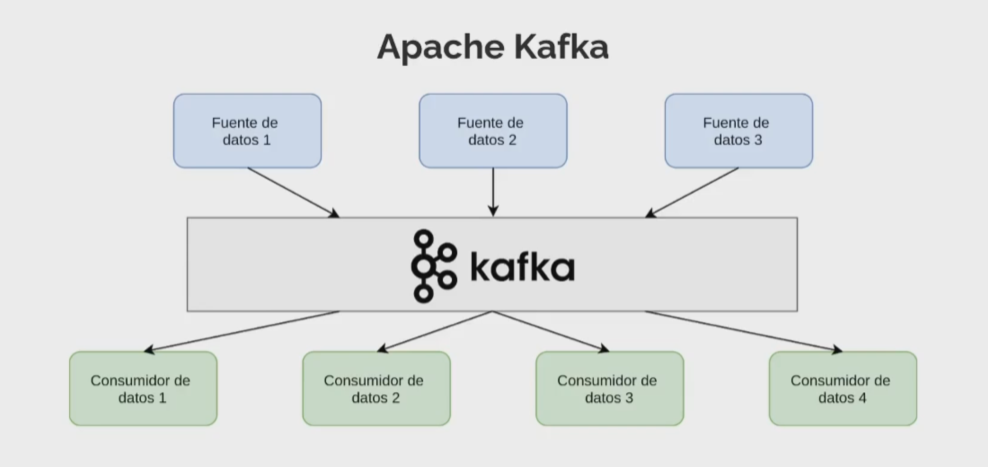
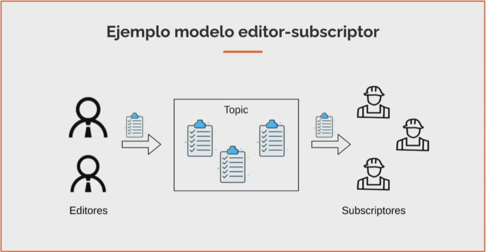
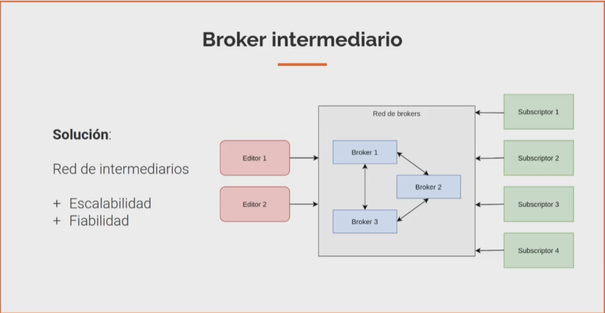
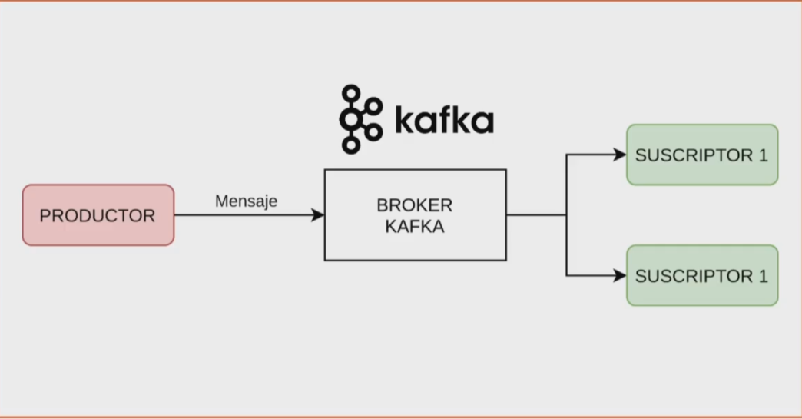
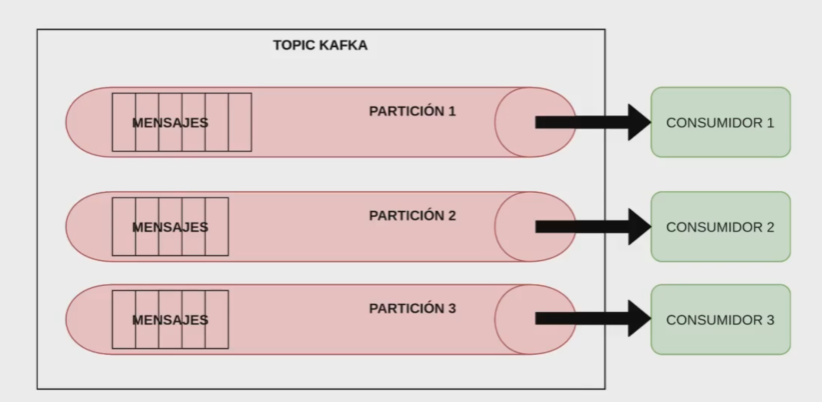

# Apache Kafka

## ¿Qué es Apache Kafka?

Es una plataforma distribuida de transmisión de datos. Permite publicar, almacenar y procesar flujos de datos en tiempo real.

### Problema Planteado

* Desarrollar, mantener y evolucionar las integraciones es complicado y costoso.
* Debemos definir formatos de datos y protocolos de intercambio en cada conexión.
* Demanda de datos creciente en el futuro.

### Solución con Kafka

En apache Kafka se pueden depositar mensajes de cualquier fuente de datos en forma de eventos.

Los consumidores también pueden ser cualquiera sistema, como bases de datos o herramientas analíticas.

### Recomendaciones de Uso

**Lenguajes utilizados en su Desarrollado**
* Java
* Scala

**¿Por qué utilizarlos?**

* Es Open Source bajo licencia Software Foundation (Licencia Apache 2.0).
* Es escalable, persistente y tolerante a fallos.
* Tiene una baja latencia (menos de 10ms).
* Integración sencilla con tecnologías Big Data.

**¿Por qué aprenderlo?**

1. Permite construir flujos de datos en tiempo real entre aplicaciones.
2. Permite construit aplicaciones que reaccionan a eventos en tiempo real.

**Casos de Uso**

* Procesamiento en Streaming. (Kafka Streams)
* Gestión de Logs.
* Sistema de recomendaciones en Tiempo Real.
* Recolección de datos e interacciones.

## Modelo Editor-Subscriptor

* Sistema de eventos distribuidos.
* Sucscriptor tiene interés por eventos.
    * Filtro - Topic.
* Editor genera eventos.
* Paradigma asíncrono.
* Desacoplado en el espacio.

### Ejemplo

* **Push**. Subscriptor recibe evento.
* **Pull**. Subscriptos pregunta si hay eventos.
* **Híbrido**. Subscriptor recibe notificación pero debe solicitar el evento.

Mecanismos Pull e Híbridos:

* Requieren almacenar eventos.
* Permiten desacoplar sistemas.
* Permiten implementar aplicaciones asíncronas.

## Broker Intermediario

* Enruta los mensajes.
* Desacoplan las aplicaciones productoras de consumidores.
* Organizan y comprueban mensajes.
* Almacenan los mensajes.

**Plataforma de Streaming**

* Kafka Streams
* Kafka Connect
* KSQL
* Schema Registry

# Topics y Particiones

## Particiones

* Son divisiones de los topics.
* Las particiones permiten distribuis los datos en los brokers.
* Es la unidad de paralelismo de Kafka.
    * Escalabilidad horizontal.
* Secienci de mensajes ordenada e inmutable.
* A cada mensaje se le asigna una clave de partición
    * Si no se especifica es aleatoria.

## Retención de Mensajes

* Los mensajes son persistidos en el disco.
* Pueden existin répicas de las particiones.
    * Previenen pérdidas de datos.
* La retención de datos en el disco es configurable.
* El rendimiento de Kafka es constante
    * No importa la cantidad ni el tamaño de los datos persistidos.

## Particiones y Offsets

* Identificador incremental asignado a cada mensaje.
* Cada partición tiene un offset asociado.
* Para identificar un mensaje necesitamos:
    * Nombre del topic.
    * Partición.
    * Offset.

# Instalación Clúster en Local

Crear nuevos directorios

    $ cp server.properties server-1.properties
    $ cp server.properties server-2.properties